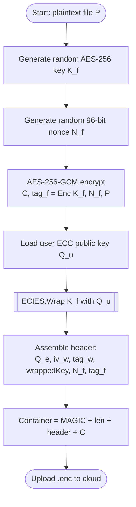
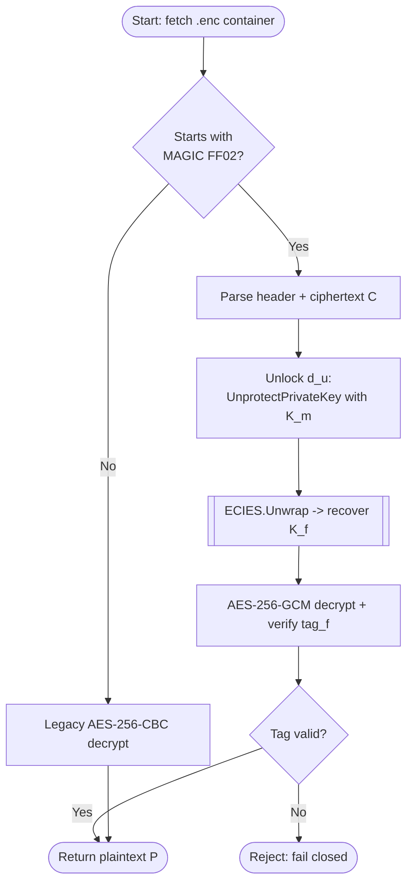
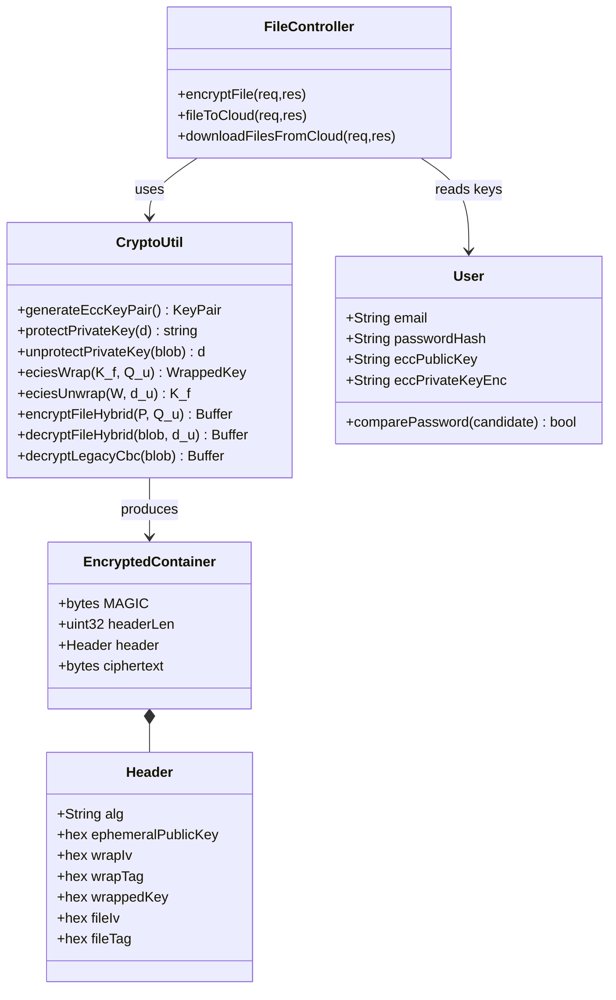
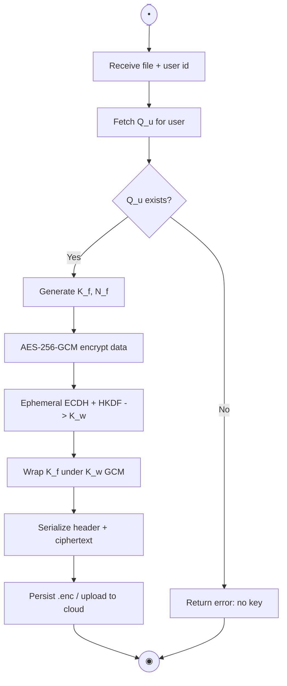
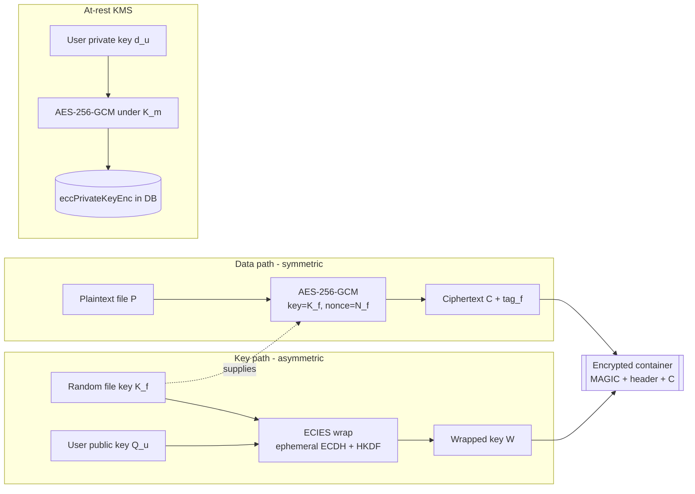
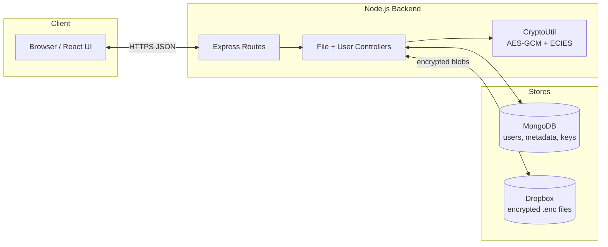

# ForteFile — Proposed Hybrid Cryptographic Algorithm
## Full Design Layout and Workflow

**Scheme:** AES-256-GCM (symmetric data encryption) + ECC over secp256k1 with ECIES key-wrapping (asymmetric key management), plus a server master key for encryption-at-rest of private keys.

---

## 1. Cryptographic Primitives and Notation

| Symbol | Meaning |
|---|---|
| `secp256k1` | Elliptic curve used for all ECC operations; `G` is its base point |
| `d_u`, `Q_u` | A user's ECC **private** and **public** key, where `Q_u = d_u · G` |
| `d_e`, `Q_e` | A one-time **ephemeral** ECC key pair generated per key-wrap |
| `K_m` | Server **master key** (256-bit), used only to protect private keys at rest |
| `K_f` | Per-file symmetric key (256-bit, random) |
| `N_f` | Per-file GCM nonce (96-bit, random) |
| `ECDH(a, B)` | Elliptic-Curve Diffie–Hellman shared secret from private `a`, public `B` |
| `HKDF(s, salt, info, L)` | HKDF-SHA256 deriving `L` bytes from secret `s` |
| `AEAD_Enc/Dec` | AES-256-GCM authenticated encryption / decryption (128-bit tag) |
| `‖` | Byte concatenation |

**Design principles**

- **Hybrid:** asymmetric ECC protects the key; fast symmetric AES protects the bulk data.
- **Fresh material per file:** a new `K_f` and `N_f` for every file (no key/IV reuse).
- **Authenticated everywhere:** GCM tags on file data, on the key-wrap, and on the at-rest private key give integrity + tamper detection.
- **Self-describing container:** the wrapped key travels inside the encrypted file, so it survives cloud round-trips with no database dependency.

---

## 2. Key and Data Objects

```
User               = { email, passwordHash(bcrypt), eccPublicKey Q_u, eccPrivateKeyEnc }
eccPrivateKeyEnc   = iv ‖ tag ‖ ciphertext           (d_u encrypted under K_m)
WrappedKey W       = { Q_e, iv_w, tag_w, ct_w }        (ECIES output protecting K_f)
Encrypted file     = MAGIC("FF02") ‖ len(header) ‖ header(JSON) ‖ C
header             = { alg, Q_e, iv_w, tag_w, wrappedKey=ct_w, fileIv=N_f, fileTag=tag_f }
C                  = AES-256-GCM ciphertext of the plaintext file
```

---

## 3. Algorithm Layout (Formal Routines)

### 3.1 `KeyGen` — user registration
```
KeyGen():
    (d_u, Q_u) ← ECC.GenerateKeyPair(secp256k1)
    store Q_u                              # public, in the clear
    store eccPrivateKeyEnc ← ProtectPrivateKey(d_u)
    return (Q_u, eccPrivateKeyEnc)
```

### 3.2 `ProtectPrivateKey` / `UnprotectPrivateKey` — at-rest KMS
```
ProtectPrivateKey(d):
    iv ← Random(12 bytes)
    (ct, tag) ← AEAD_Enc(key=K_m, nonce=iv, plaintext=d)
    return hex(iv) ‖ ":" ‖ hex(tag) ‖ ":" ‖ hex(ct)

UnprotectPrivateKey(blob):
    (iv, tag, ct) ← split(blob, ":")
    d ← AEAD_Dec(key=K_m, nonce=iv, ciphertext=ct, tag=tag)   # throws if tampered
    return d
```

### 3.3 `ECIES.Wrap` / `ECIES.Unwrap` — protect the per-file key with ECC
```
ECIES.Wrap(K_f, Q_u):                      # encrypt K_f TO the user's public key
    (d_e, Q_e) ← ECC.GenerateKeyPair(secp256k1)     # ephemeral
    S  ← ECDH(d_e, Q_u)                              # shared secret
    K_w ← HKDF(S, salt=Q_e, info="forteFile-ecies-v2", L=32)
    iv_w ← Random(12 bytes)
    (ct_w, tag_w) ← AEAD_Enc(key=K_w, nonce=iv_w, plaintext=K_f)
    return { Q_e, iv_w, tag_w, ct_w }

ECIES.Unwrap({Q_e, iv_w, tag_w, ct_w}, d_u):
    S  ← ECDH(d_u, Q_e)                              # same secret (ECDH symmetry)
    K_w ← HKDF(S, salt=Q_e, info="forteFile-ecies-v2", L=32)
    K_f ← AEAD_Dec(key=K_w, nonce=iv_w, ciphertext=ct_w, tag=tag_w)
    return K_f
```

### 3.4 `EncryptFile` — hybrid encryption
```
EncryptFile(P, Q_u):                       # P = plaintext file bytes
    K_f ← Random(32 bytes)                  # fresh per-file AES-256 key
    N_f ← Random(12 bytes)                  # fresh per-file GCM nonce
    (C, tag_f) ← AEAD_Enc(key=K_f, nonce=N_f, plaintext=P)
    W ← ECIES.Wrap(K_f, Q_u)
    header ← JSON{ alg:"AES-256-GCM+ECIES-secp256k1",
                   Q_e:W.Q_e, iv_w:W.iv_w, tag_w:W.tag_w,
                   wrappedKey:W.ct_w, fileIv:N_f, fileTag:tag_f }
    return MAGIC("FF02") ‖ uint32(len(header)) ‖ header ‖ C
```

### 3.5 `DecryptFile` — hybrid decryption
```
DecryptFile(blob, d_u):
    assert blob[0..4) == MAGIC("FF02")      # else route to legacy CBC path
    hlen  ← uint32(blob[4..8))
    header← JSON(blob[8 .. 8+hlen))
    C     ← blob[8+hlen .. end)
    K_f ← ECIES.Unwrap(header, d_u)
    P   ← AEAD_Dec(key=K_f, nonce=header.fileIv, ciphertext=C, tag=header.fileTag)
    return P                                 # throws on any tamper -> fail closed
```

### 3.6 End-to-end orchestration
```
UPLOAD(file, user):
    P ← read(file)
    Q_u ← lookupPublicKey(user)
    container ← EncryptFile(P, Q_u)
    storeToCloud(container as "<userId>_<date>_<name>.enc")
    deletePlaintext(file)

DOWNLOAD(ref, user):
    container ← fetchFromCloud(ref)
    if container starts with MAGIC("FF02"):
        d_u ← UnprotectPrivateKey(user.eccPrivateKeyEnc)   # unlock with K_m
        P ← DecryptFile(container, d_u)
    else:
        P ← DecryptLegacyCBC(container)                    # backward compatibility
    return P
```

---

## 4. Workflow Diagrams

> The diagrams below are written in **Mermaid**. Open the companion HTML file to see
> them rendered, or paste any block into a Mermaid-capable editor.

### 4.1 Flowchart — Encryption



### 4.2 Flowchart — Decryption



### 4.3 UML Sequence Diagram — Upload then Download

```mermaid
sequenceDiagram
    actor U as User
    participant FE as Frontend (React)
    participant BE as Backend Controller
    participant DB as User Model / KMS (K_m)
    participant CL as Cloud (Dropbox)

    Note over U,CL: ENCRYPTION / UPLOAD
    U->>FE: select file, click Encrypt
    FE->>BE: POST /encrypt-multiple
    BE->>DB: get user ECC public key Q_u
    DB-->>BE: Q_u
    BE->>BE: K_f, N_f random; AES-256-GCM encrypt -> C, tag_f
    BE->>BE: ECIES.Wrap(K_f, Q_u) -> W
    BE->>BE: build container (header + C)
    BE->>CL: upload .enc
    CL-->>BE: ok
    BE-->>FE: success

    Note over U,CL: DECRYPTION / DOWNLOAD
    U->>FE: select file, click Download
    FE->>BE: POST /download-multiple
    BE->>CL: fetch .enc
    CL-->>BE: container
    BE->>DB: get eccPrivateKeyEnc; unlock d_u with K_m
    DB-->>BE: d_u
    BE->>BE: ECIES.Unwrap -> K_f; AES-256-GCM decrypt+verify
    BE-->>FE: plaintext (zipped)
    FE-->>U: file downloaded
```

### 4.4 UML Class Diagram — Modules



### 4.5 UML Activity Diagram — Encrypt Activity



### 4.6 Block Diagram — Data Path vs Key Path



### 4.7 Block Diagram — Deployment / System View



---

## 5. Security Properties Summary

| Property | Mechanism |
|---|---|
| Confidentiality (data) | AES-256-GCM with per-file random key `K_f` |
| Confidentiality (key) | ECIES wrap to user public key `Q_u` (secp256k1) |
| Integrity / tamper detection | GCM auth tags on data, key-wrap, and at-rest key (100% fault detection, fail-closed) |
| Key freshness | New `K_f`, `N_f`, and ephemeral `Q_e` per operation (no reuse) |
| Diffusion | AES avalanche ≈ 50% on key/nonce change (Strict Avalanche Criterion) |
| Key management | Private keys stored encrypted-at-rest under server master key `K_m` |
| Backward compatibility | Legacy AES-256-CBC files auto-detected and still decryptable |
```
